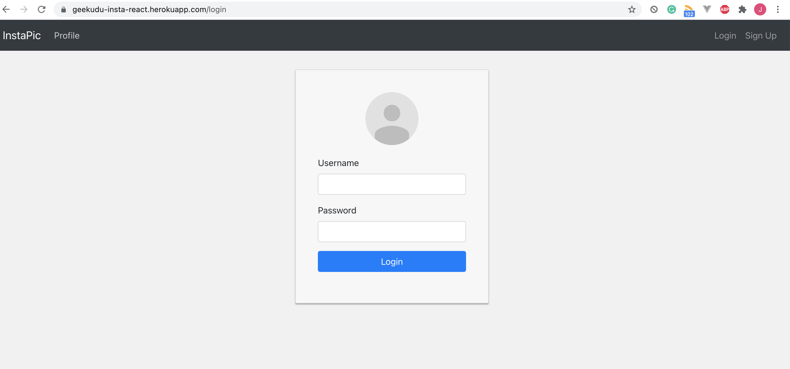
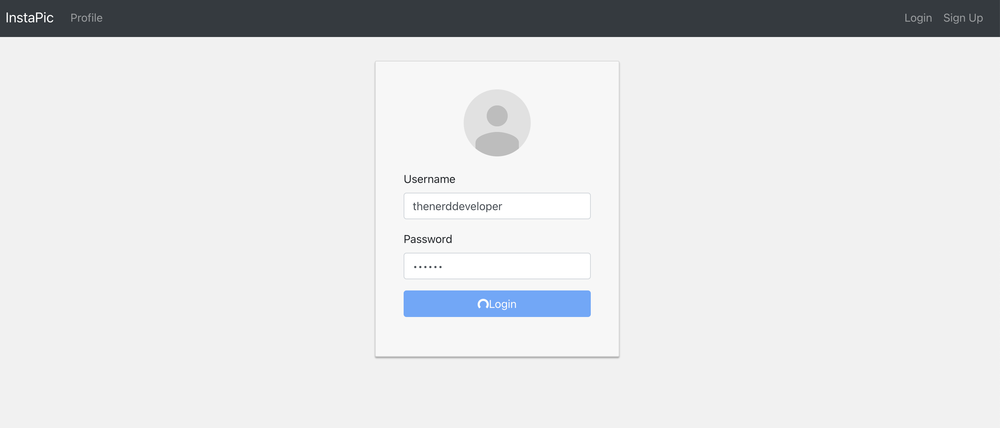
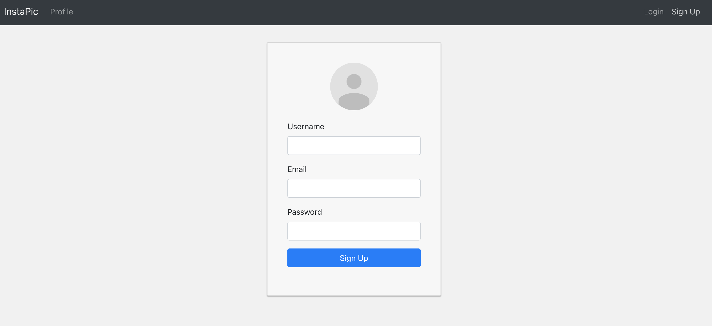
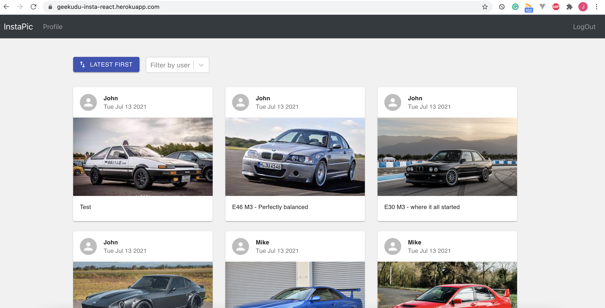
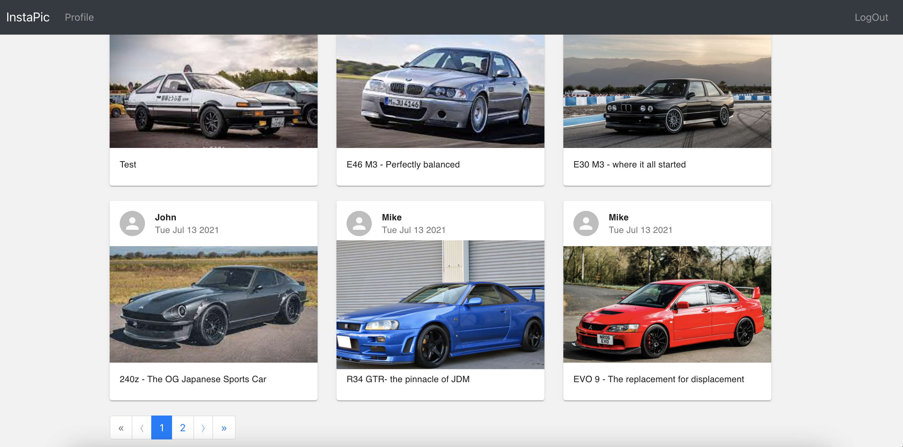
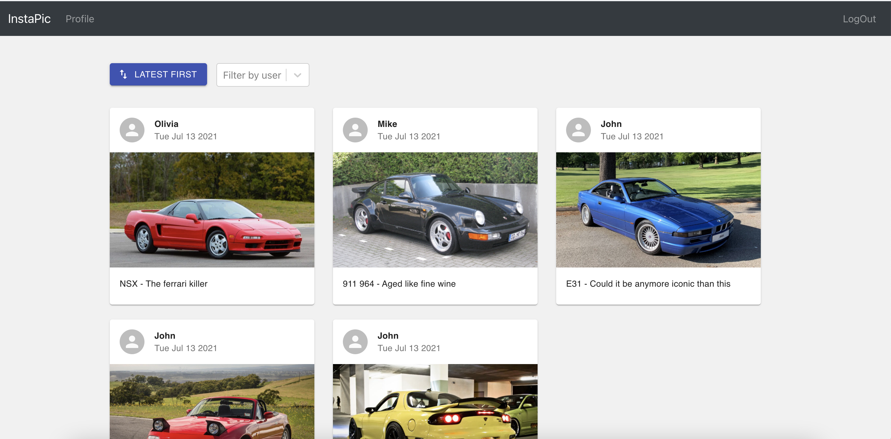
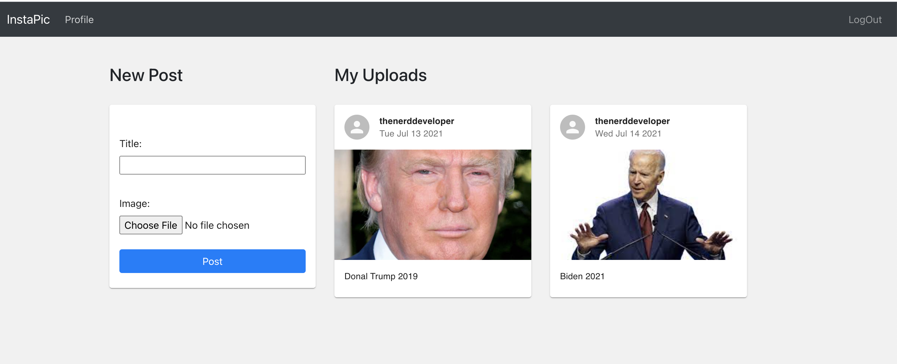
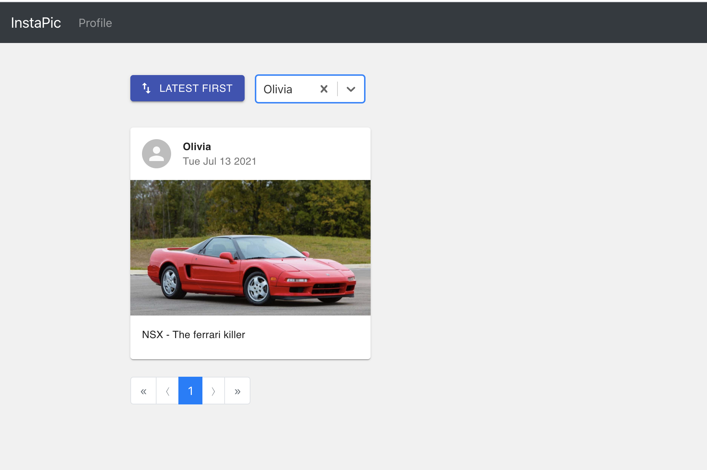

# React Image Share Application
sample image sharing application Frontend developed in ReactJS

please find the demo hosted on heroku at
https://geekudu-insta-react.herokuapp.com/

## Setup
Clone the repository.

Install the libraries and starting app
```bash
npm install
npm start
```

## Screenshots
Please see some of the screenshots of the live project.


### Login Page

<br />


<br />
<br />

### Register Page


<br />
<br />

### Dashboard Page

<br />
<br />

### Dashboard Page with pagination

<br />

<br />
<br />

### Profile Page where the current logged in user can upload new photo
```language
Note:
In profiles page, logged in user can only see their posts
which they have uploaded.
If they want to see other users posts, they will see that on Dashboard.

```

<br />
<br />
### Filters- Filter posts by users. Sort posts by date and time.

<br />
<br />

-----------------------------------------------------------------------


Thank You :blush:

&copy; 2021 Thenerddeveloper. All Rights Reserved

*last updated on July 14, 2021*
